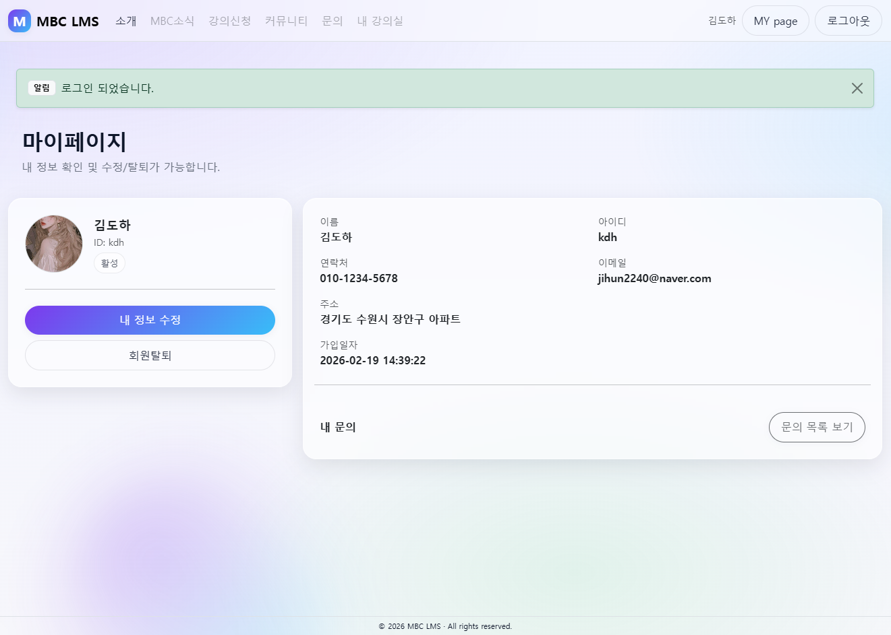
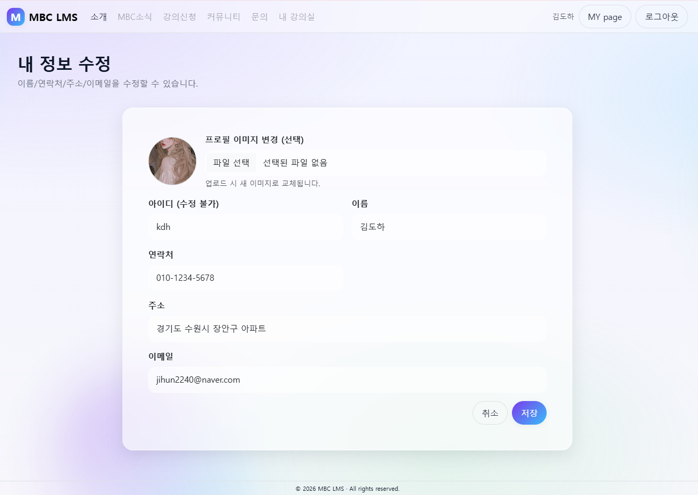
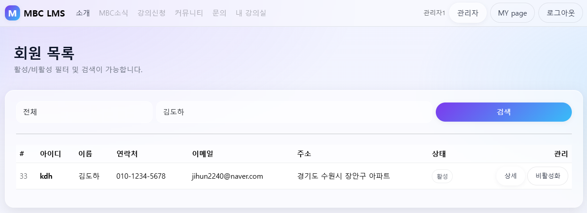
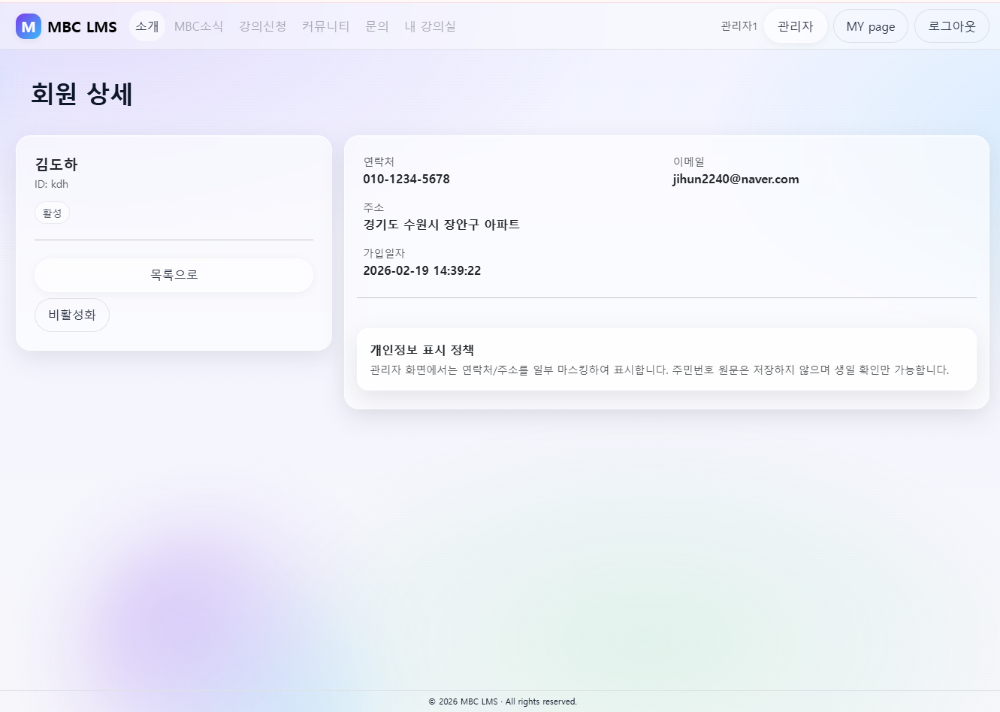

# MBC Academy LMS Program

Python(Flask) · MySQL · 웹개발 설계 평가시험용 프로그램입니다.
회원(일반/관리자) 권한에 따라 기능이 분리하여 설계했습니다.

---

## 메인 화면


---

# 회원 프론트 구현

- 로그인
- 회원가입
- 마이페이지
- 회원정보 수정
- 회원탈퇴
  
## 로그인


## 회원가입


## 마이페이지


## 회원수정


---
# 관리자 페이지 프론트 구현

**추가기능 구현으로는 관리자 페이지를 구현해봤습니다.**
- 회원상태를 확인할 수 있는 대시보드
- 회원 목록 리스트 페이지
- 회원검색기능
- 회원상세보기
- 회원 비활성화 처리 기능 

## 관리자 대시보드


## 회원목록리스트 화면


## 회원검색 화면


## 회원상세보 화면


---

# MYSQL DB 생성 및 테이블 코드 
## DB 생성 
```
/*DB를 새로 생성한다.*/
CREATE DATABASE mbc_text 
DEFAULT CHARACTER SET utf8mb4 
/*utf8mb4 | 한글, 특수문자, 이모지까지 완전 지원*/
COLLATE utf8mb4_general_ci;
/*COLLATE | 문자열 정렬/비교 방식 지정 // general_ci | 대소문자 구분 없이 비교*/


SHOW DATABASES; /*DB 리스트 조회*/
USE mbc_text; /*mbc DB 사용*/

/*사용자 계정 생성 및 권한 부여*/
CREATE USER 'text'@'192.168.0.%' IDENTIFIED BY '1234';
/*			 ID    접속권한 PC                    pc*/

GRANT ALL PRIVILEGES ON mbc_text.* TO 'text'@'192.168.0.%';
/*권한 부여   모든권한      DB명  모든테이블ID@접속권한*/
FLUSH PRIVILEGES; 
/*즉시권한적용*/
```
## MEMBERS 테이블 생성
```
USE mbc_text;

-- 1) MEMBERS (회원)
-- ---------------------------------------
CREATE TABLE members (
  id INT AUTO_INCREMENT PRIMARY KEY,

  -- 로그인
  uid VARCHAR(50) NOT NULL UNIQUE,
  password VARCHAR(255) NOT NULL,

  -- 기본정보
  name VARCHAR(50) NOT NULL,
  phone VARCHAR(20) NOT NULL,
  email VARCHAR(120) NOT NULL UNIQUE,
  address VARCHAR(255) NOT NULL,
  profile_img VARCHAR(255) NULL,
  role ENUM('USER','ADMIN') NOT NULL DEFAULT 'USER',
  active BOOLEAN DEFAULT TRUE,
  created_at DATETIME NOT NULL DEFAULT CURRENT_TIMESTAMP,
  updated_at DATETIME NOT NULL DEFAULT CURRENT_TIMESTAMP ON UPDATE CURRENT_TIMESTAMP);
  
  ```

# 프로젝트 트리

```
mbc_text/
│
├── app.py                  # 프로그램 실행
├── config.py
│
├── common/                 # 공통 모듈
│   ├── auth.py             # 기존 session과 비슷한 기능으로 구현
│   ├── db.py               # DB연결
│   └── upload.py           # 파일 첨부 기능
│
├── repository/             # DB 접근 계층
│   └── member_repo.py
│
├── service/                # 비즈니스 로직
│   ├── admin_service.py
│   └── member_service.py
│
├── routes/                 # URL연결
│   ├── admin_routes.py
│   ├── member_routes.py
│   └── main_routes.py
│
├── templates/              # HTML 
│   ├── layout.html
│   ├── main.html
│   │
│   ├── partials/
│   │   ├── navbar.html
│   │   ├── footer.html
│   │   ├── flash.html
│   │   └── page_header.html
│   │
│   ├── admin/
│   │   ├── dashboard.html
│   │   ├── members_list.html
│   │   └── member_detail.html
│   │
│   └── member/
│       ├── login.html
│       ├── join.html
│       ├── edit.html
│       ├── find_id.html
│       └── mypage.html
│
├── static/
│   ├── css/
│   ├── js/
│   ├── img/                 # main 페이지 이미지 저장공간
│   └── uploads/             # 업로드 첨부파일 저장공간(프로필 이미지)
│
└── docs/                   # README 이미지 전용 폴더입니다.
    └── img/
```
